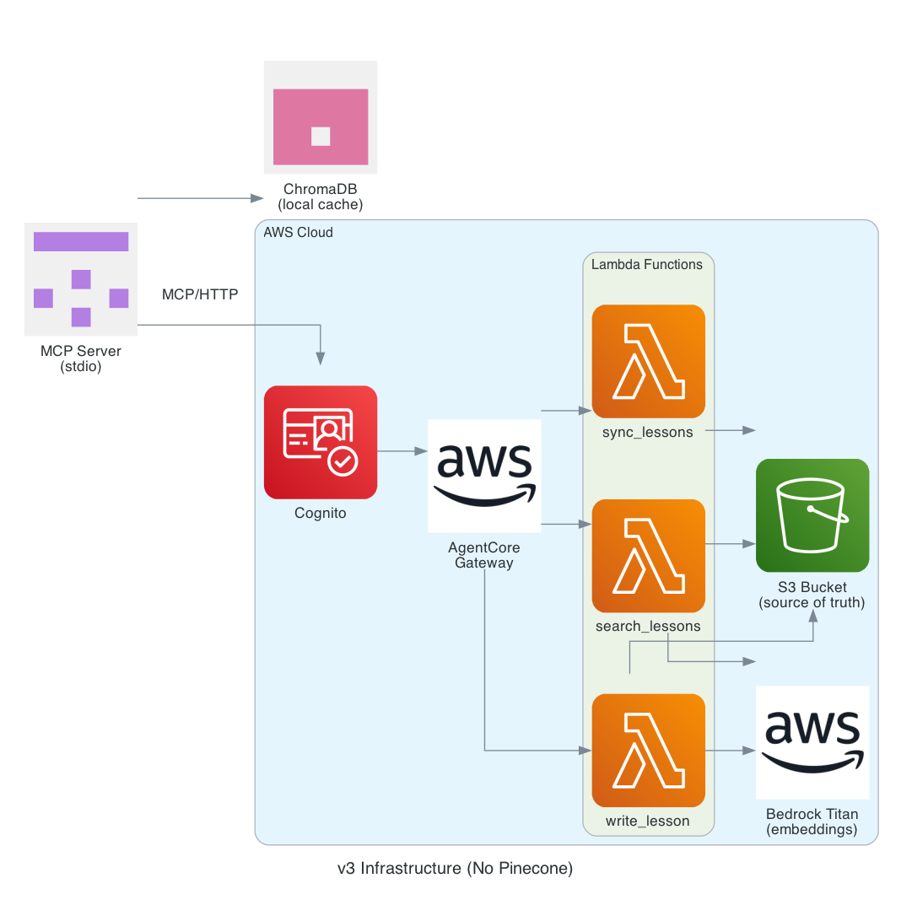
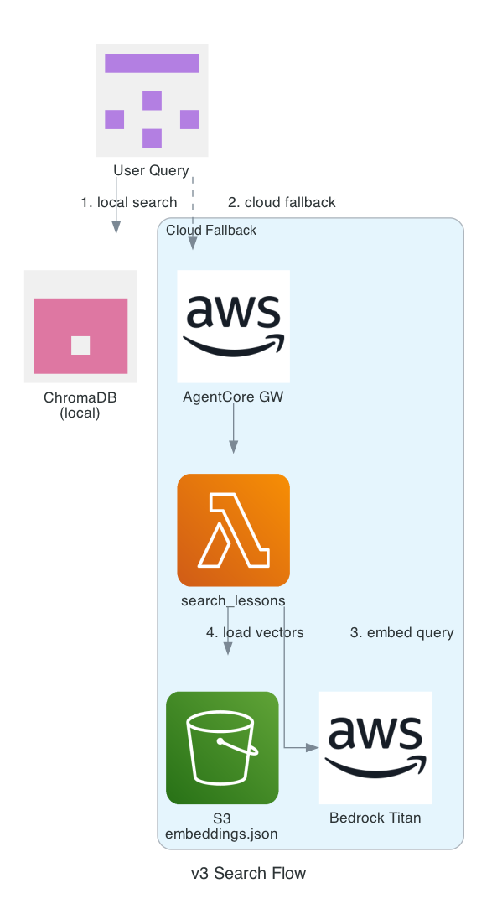
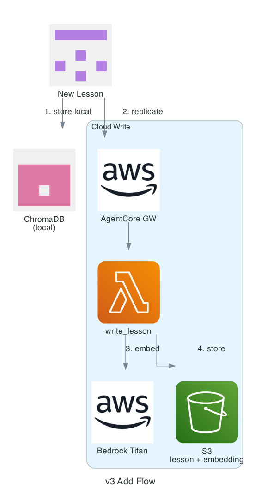

# MCP Knowledge Base

An MCP server for storing and retrieving lessons learned — debugging tips, solutions, and patterns that your AI agents can search and build upon.

## Architecture



**Local** (pip installable):
- FastMCP server (stdio transport) for Kiro CLI / Claude Desktop
- ChromaDB + all-MiniLM-L6-v2 for fast local semantic search
- Syncs from cloud on demand

**Cloud** (deployable to any AWS account):
- AgentCore Gateway (managed MCP endpoint with Cognito JWT auth)
- Lambda functions: `write_lesson`, `search_lessons`, `sync_lessons`
- S3 bucket (source of truth) + Bedrock Titan embeddings
- Brute-force cosine similarity in Lambda (no vector DB needed at personal scale)

## Quick Start

### Install the local MCP server
```bash
pip install ./server
```

### Configure (optional — enables cloud sync)
```bash
export MCP_KB_GATEWAY_URL=https://your-gateway.bedrock-agentcore.us-west-2.amazonaws.com/mcp
export MCP_KB_TOKEN_URL=https://your-pool.auth.us-west-2.amazoncognito.com/oauth2/token
export MCP_KB_CLIENT_ID=your-cognito-client-id
export MCP_KB_CLIENT_SECRET=your-cognito-secret
```

Without cloud config, the server works in local-only mode with ChromaDB.

### Add to Kiro CLI
```json
{
  "mcpServers": {
    "knowledge-base": {
      "command": "mcp-kb",
      "env": {
        "MCP_KB_GATEWAY_URL": "...",
        "MCP_KB_TOKEN_URL": "...",
        "MCP_KB_CLIENT_ID": "...",
        "MCP_KB_CLIENT_SECRET": "..."
      }
    }
  }
}
```

## Tools

| Tool | Description |
|---|---|
| `add_lesson` | Store a new lesson (topic, problem, resolution, tags) — saves locally + replicates to cloud |
| `search_lessons` | Semantic search — local ChromaDB first, cloud fallback |
| `sync` | Pull all lessons from cloud into local ChromaDB cache |

## Deploy Cloud Backend

See [docs/DEPLOYMENT.md](docs/DEPLOYMENT.md) for full instructions.

```bash
cd infra/

# 1. S3 + Lambdas
sam build && sam deploy

# 2. Cognito
aws cloudformation deploy --template-file cognito.yaml --stack-name mcp-kb-cognito

# 3. AgentCore Gateway
aws cloudformation deploy --template-file gateway.yaml --stack-name mcp-kb-gateway --capabilities CAPABILITY_NAMED_IAM

# 4. Gateway Targets
aws cloudformation deploy --template-file targets.yaml --stack-name mcp-kb-targets
```

## Flows

| Search | Add |
|---|---|
|  |  |

## Cost

Personal use (~100 lessons, occasional searches): **~$0.50/month** (Lambda invocations + Bedrock Titan embedding calls + S3 storage).

## License

MIT
