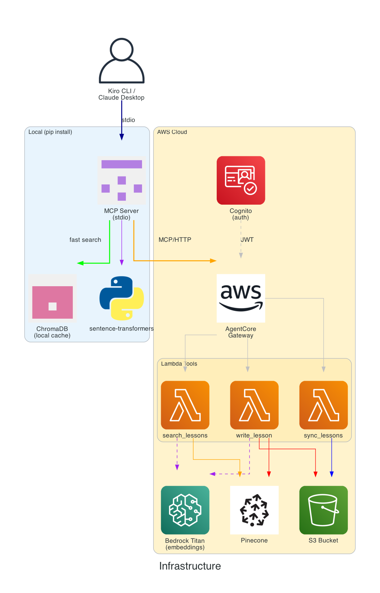
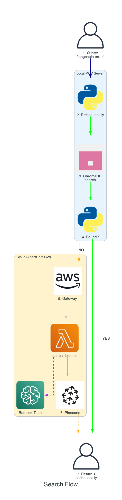
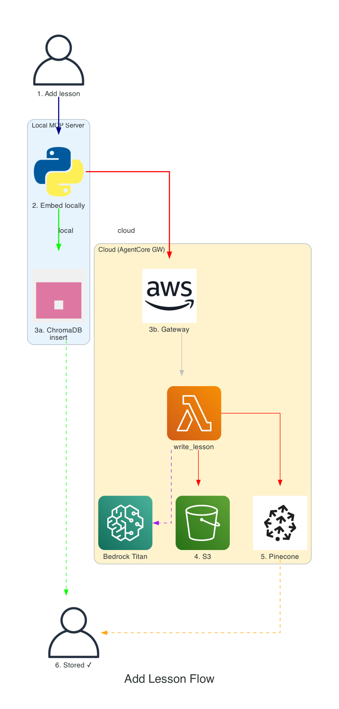

# MCP Knowledge Base

An MCP server for storing and retrieving lessons learned — debugging tips, solutions, and patterns that your AI agents can search and build upon.

## Architecture



**Local** (pip installable):
- FastMCP server (stdio transport) for Kiro CLI / Claude Desktop
- ChromaDB + sentence-transformers for fast local semantic search
- Syncs from cloud on startup

**Cloud** (SAM deployable to any AWS account):
- AgentCore Gateway (managed MCP endpoint with Cognito auth)
- Lambda functions: `write_lesson`, `search_lessons`, `sync_lessons`
- S3 bucket (source of truth)
- Pinecone (cloud vector search via Bedrock Titan embeddings)

## Quick Start

### Install the MCP server
```bash
pip install mcp-kb
```

### Configure
```bash
export MCP_KB_GATEWAY_URL=https://xxx.bedrock-agentcore.us-east-1.amazonaws.com
export MCP_KB_CLIENT_ID=your-cognito-client-id
export MCP_KB_CLIENT_SECRET=your-cognito-secret
```

### Deploy cloud backend (to your own AWS account)
```bash
cd infra/
sam build && sam deploy --guided
```

## Tools

| Tool | Description |
|---|---|
| `add_lesson` | Store a new lesson (topic, error, resolution) |
| `search_lessons` | Semantic search across lessons |
| `list_topics` | List all lesson topics |
| `sync` | Sync local cache from cloud |

## Flows

| Search | Add |
|---|---|
|  |  |

## License

MIT
